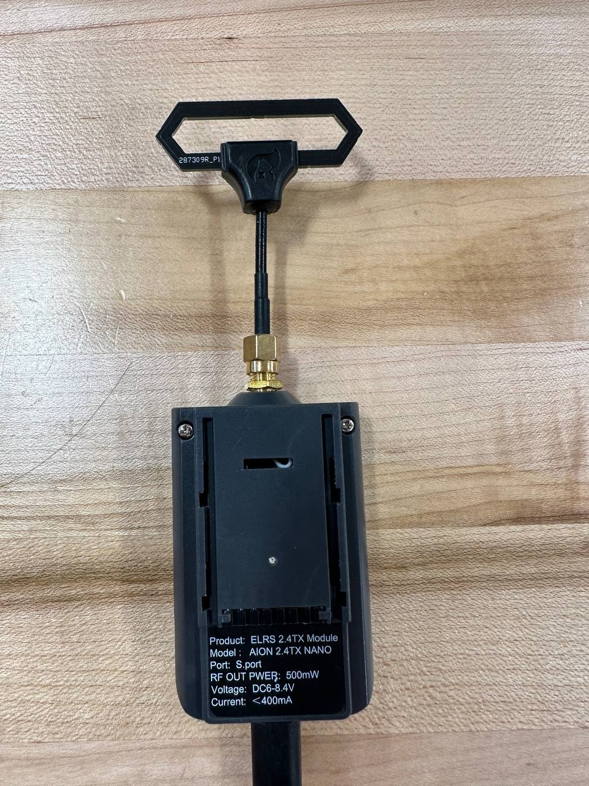

# joy2crsf_ros2
---

##  Description
`joy2crsf_ros2` is a ROS 2 package that allows you to control a drone through **ELRS (Crossfire/CRSF protocol)** using a **joystick** connected to your PC.  
It converts joystick inputs into CRSF channel packets and sends them via serial to an ELRS transmitter module.
In that way you will be able to control your drone manually from Logitech like joystick (instead of EdgeTX).
This repo opens opportunities for further autonomous drone development as PC to Drone connection settled.
---

## ✨ Features
- Joystick → CRSF channel mapping (roll, pitch, throttle, yaw, arm, angle, aux)
- Serial communication with ELRS at 115200 baud
- Telemetry reading (RSSI, Link statistics, GPS, Attitude, etc.)
- ROS 2 `sensor_msgs/msg/Joy` subscription
- Toggle arming and flight mode with joystick buttons

---
## 🛠 Requirements
### Software:
- Ubuntu (any vesion or any OS that supports ROS2 Humble)
- Betaflight software (for debugging)
- ROS 2 Humble (or newer)
- Python 3.8+
- Packages:
  - `rclpy`
  - `sensor_msgs`
  - `pyserial`
### Hardware:
  - Drone (TinyWhoop Modula6 was used)
  - ELRS TX module 
  - Power supply (in case TX module consumes more than 5V)
  - USB cable for TX-PC connection
  - Joystick (Logitech was used)
---
## Hardware setup procedure 
### 1. Drone
Flash both Drone and TX module, bind them and prepare setup through Betaflight software (https://www.youtube.com/@JoshuaBardwell), ideally try flying it to make sure it works as supposed to.
### 2. ELRS TX module
Connect TX module to PC through USB cable. In case your TX needs more than 5V, connect external power supply with pinout as below:
GND is on PIN 2 and V is on PIN 3 (From left to right)


---
## ⚙️ Build
Clone into your workspace and build with `colcon`:

```bash
cd ~/ros2_ws/src
git clone https://github.com/lantacisaza/joy2crsf_ros2.git
rosdep install --from-paths . --ignore-src -r -y
cd ~/ros2_ws
colcon build 
source install/setup.bash
```
---
## Install joystick package
```bash
ls /dev/input/js*
# expect: /dev/input/js0
sudo apt update
sudo apt install joystick
jstest /dev/input/js0   # move sticks; you should see numbers change, then exit

sudo apt install ros-humble-joy ros-humble-teleop-twist-joy

echo 'source /opt/ros/humble/setup.bash' >> ~/.bashrc
# If you have a dev workspace, also add:
echo 'source ~/ros2_ws/install/setup.bash' >> ~/.bashrc
source ~/.bashrc
```

## Usage
FOr your own convinience, use Terminator to be able to see all 3 terminals at once.
### 1. Start the joystick driver. Logitech joystick was used.
In one terminal, run the standard ROS2 joystick driver:
```bash
ros2 run joy joy_node
```
### 2. (Optional) Monitor joystick messages
In another terminal, you can check raw joystick data:
```bash
ros2 topic echo /joy
```
### 3. Run the joystick → CRSF node in another terminal
```bash
colcon build 
source install/setup.bash
ros2 run crsf_joystick joy_to_crsf
```

### 4. Confirmation
Look at the TX module's screen. You should be able to see "Connected" written.
In case you do not see it, try using the central button of TX to navigate to the "Binding" section and pressing it.
You should then see the color of the LED on the TX to be changed to BLUE. Use same button to exit settings and youll see "Connected".

### 5. Fly!
Press LB to Arm the Drone. RB is used to change between ACRO and STAB modes. PItch, Yaw and Roll should work same as on EdgeTX.
Throttle is set to 0 in neutral position.

## License
This project is licensed under the MIT License – see the [LICENSE](LICENSE) file for details.

Portions of the CRSF parsing logic are adapted from the [CRSF Working Group](https://github.com/crsf-wg) repository (MIT License).
